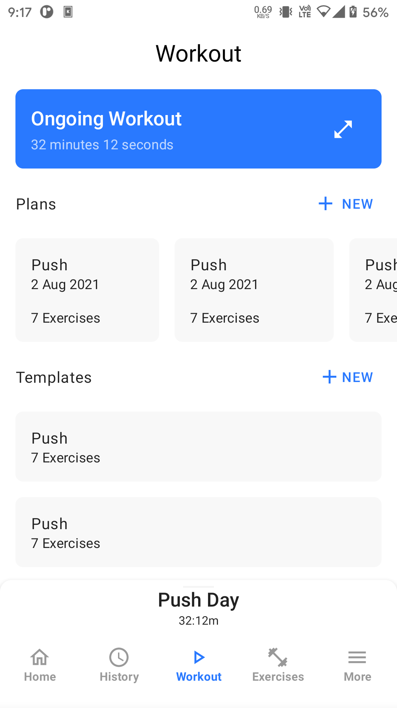

# Rebound App (Under Construction)

Feature Rich & Highly Customizable Workout Log App

> Further development will we closed source. App will be available to download soon on Play Store.
> For more info please visit: https://shredded.ankitsuda.com/
 
## Donate

## Screenshots (Outdated)

|  |  |  | 
|:---:|:---:|:---:|
|Workout Panel|Workout Tab|History Tab|

|  |  | |
|:---:|:---:|:---:|
|Exercises Tab|Calendar Screen|More Tab|

|  |  |  | 
|:---:|:---:|:---:|
|Personalization Screen|Main Colors Customizations|Exercise Details Stats|

|  |  |  |
|:---:|:---:|:---:|
|Themed Workout Panel|Themed Workout Details|Themed Exercise Details|
## Features

As of now I am trying to implement most of the core features, but more features will be added soon.
Most of the below features are either not implement or not stable enough yet, but will be soon.

- Highly customizable
- Material Design
- Open Source
- Sliding panel for session
- Routines
- Transformations
- History
- Body Part & Weight Measurements
- Timers
- Customizable Bars & Plates
- Supersets.
- Plate Calculator
- Warm-up Sets Calculator
- 1RM, Max Volume, Max Weight, Personal Records etc.
- Exercises Database
- Workout & Set Notes
- Achievements
- Statistics (Charts, Graphs etc.)
- Languages Support

## Tech stack

Rebound uses latest Android technologies and most best practices. Here is the tech stack currently
in use-

- MVVM Architecture
- Jetpack Compose
- Kotlin
- Coroutines
- Room
- Jetpack Navigation
- Flow, LiveData
- DataStore
- Hilt
## License

Rebound is released under the GNU General Public License v3.0 (GPLv3), which can be
found [here](LICENSE.md)
